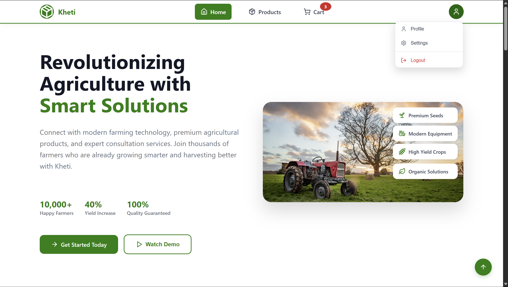
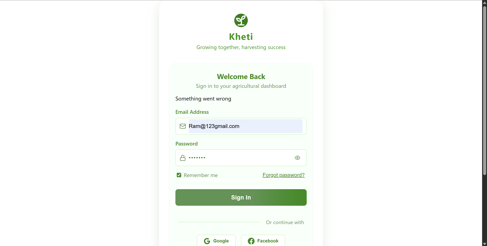
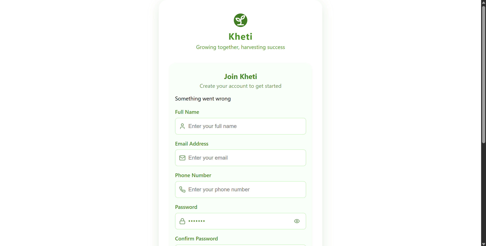
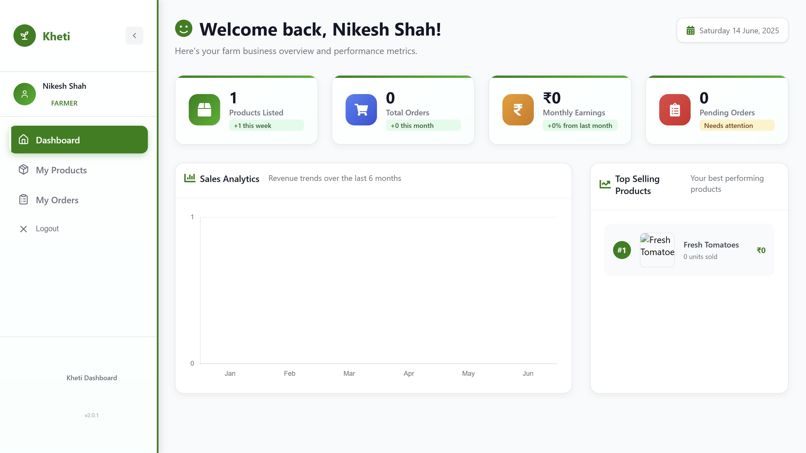
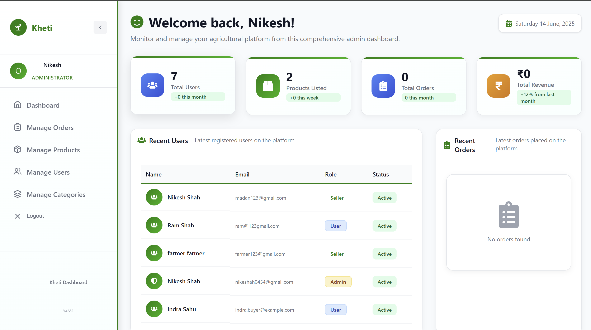

# 🌱 Kheti App

Kheti is a full-stack MERN (MongoDB, Express.js, React, Node.js) web application that directly connects **farmers** and **consumers**. The goal is to empower local farmers to earn more by eliminating middlemen, while enabling consumers to access **fresh**, **real**, and **affordable** agricultural products.


## 🧩 Features

### 👨‍🌾 For Farmers:
- List and manage their products.
- Track orders and earnings via a detailed dashboard.
- View analytics and low-stock alerts.
- Receive direct orders from consumers.

### 🛒 For Consumers:
- Browse fresh agricultural products directly from farmers.
- Place orders with a simple cart system.
- Track order status.

### 📊 Dashboards:
- Interactive charts and analytics (sales, earnings, inventory).
- Quick stats like pending orders, top-selling products, and more.

---

## 📸 Screenshots

### 🧑‍🌾 Home page


### 🧑‍🌾 Login



### 🧑‍🌾 Register




### 🧑‍🌾 Farmer Dashboard



### 🧑‍🌾 Admin Dashboard




---

## 🛠️ Tech Stack

- **Frontend**: React, Tailwind CSS, Chart.js, React Icons
- **Backend**: Node.js, Express.js
- **Database**: MongoDB Atlas
- **Authentication**: JWT-based Auth (Farmer & Consumer roles)
- **Charts & Analytics**: `chart.js` integrated with farmer sales data

---

## 🚀 Getting Started

### 1. Clone the repo

```bash
git clone https://github.com/Nikesh-Shah/kheti-app.git
cd kheti-app
